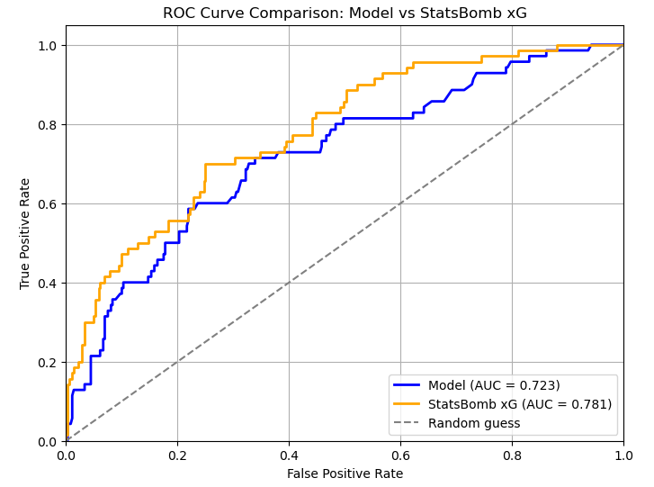
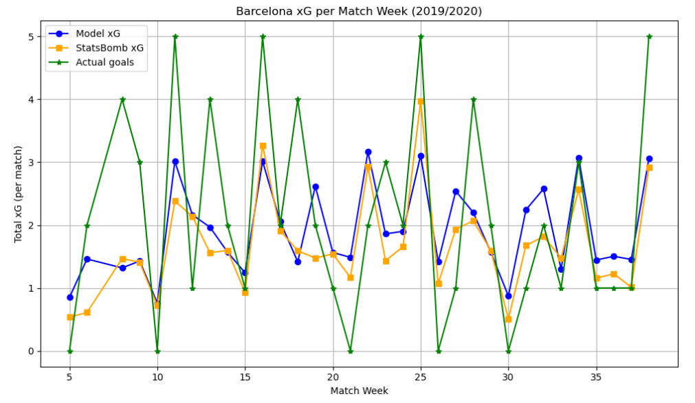
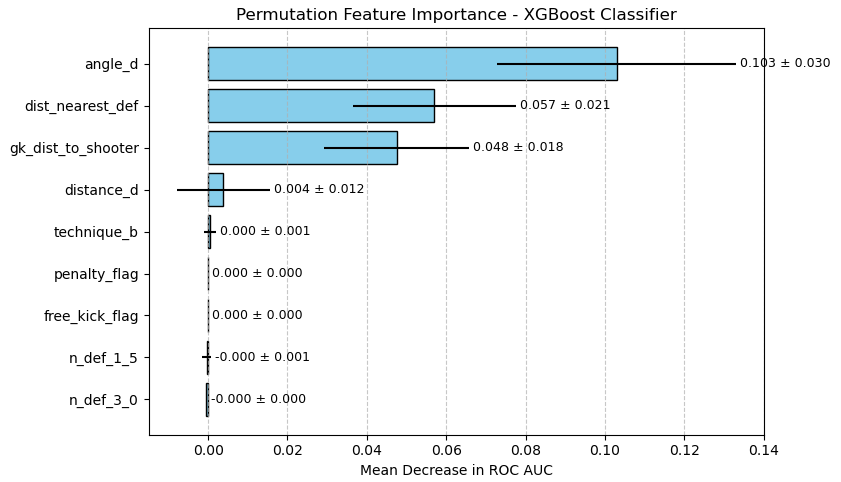
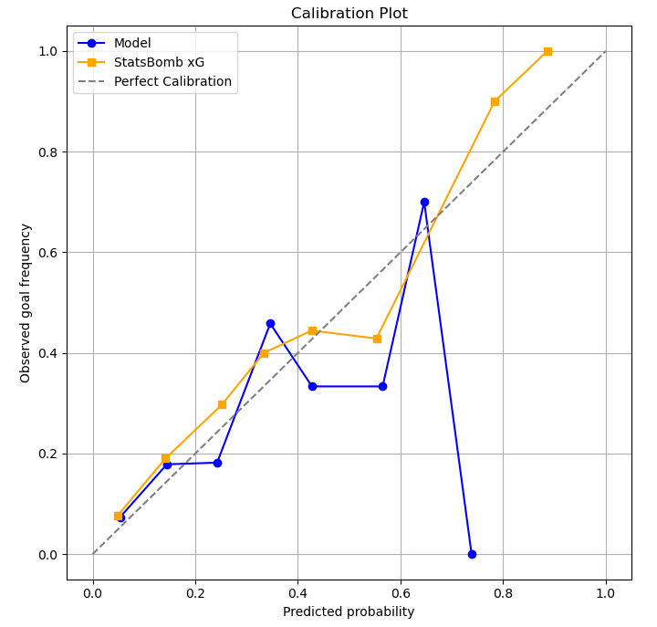

# Football Expected Goals (xG) and Expected Assists (xA)

This project develops machine learning models for estimating Expected Goals (xG) and Expected Assists (xA) from football event data. Multiple supervised learning algorithms are trained, optimized, and evaluated. Where available, model predictions are compared against the StatsBomb xG benchmark.

## Project Features

- Automated data collection from StatsBomb Open Data
- Feature engineering for shot and pass events
- Modular Python implementation
- Model evaluation using ROC AUC, Log Loss, Brier Score, and Accuracy
- Comparison with the StatsBomb xG benchmark (where applicable)
- Visualization of model performance

## Repository Structure

```text
football-xg-xa/
│
├── notebooks/
│   ├── data_preparation.ipynb      # Data preparation and feature engineering
│   ├── xg_models.ipynb             # Expected Goals (xG) models
│   ├── xa_models.ipynb             # Expected Assists (xA) models
│   └── combined_models.ipynb       # Combined xG + xA feature models
│
├── src/
│   ├── data.py                     # Data loading utilities
│   ├── features.py                 # Feature selection utilities
│   ├── models.py                   # Model training and evaluation functions
│   ├── visualization.py            # Visualization utilities
│   └── __init__.py
│
├── README.md
├── requirements.txt
├── LICENSE
├── .gitignore
└── .gitattributes
```

## Data

The datasets used in this project are generated automatically by `data_preparation.ipynb`.

The notebook downloads publicly available StatsBomb Open Data and extracts all FC Barcelona shot events from the following La Liga seasons:

- 2017–2018
- 2018–2019
- 2019–2020
- 2020–2021

FC Barcelona was selected because it is the only La Liga team in the StatsBomb Open Data repository with complete match coverage across all four seasons.

The notebook performs feature engineering, extracts both shot and key-pass features, and generates the datasets required by the modelling notebooks.

Running the notebook produces:

```text
training_barcelona_shots.xlsx
testing_barcelona_shots.xlsx
```

## Installation

Install the required packages:

```bash
pip install -r requirements.txt
```

## How to Run

1. Run `data_preparation.ipynb` to download the StatsBomb Open Data and generate the training and testing datasets.
2. Run `xg_models.ipynb` to train and evaluate the Expected Goals models.
3. Run `xa_models.ipynb` to train and evaluate the Expected Assists models.
4. Run `combined_models.ipynb` to train and evaluate the combined feature models.

## Models

The project evaluates four supervised machine learning algorithms across three experimental settings:

- Expected Goals (xG)
- Expected Assists (xA)
- Combined xG + xA features

Each experiment evaluates the following models:

- Logistic Regression
- Random Forest
- Support Vector Machine (SVM)
- XGBoost

Hyperparameters are optimized using GridSearchCV with 10-fold stratified cross-validation.

## Example Outputs

The notebooks generate several outputs that facilitate model evaluation and interpretation, including:

- Cross-validation and testing performance metrics
- Weekly xG prediction plots
- Calibration curves
- ROC curves
- Permutation feature importance
- Logistic Regression coefficient analysis

### ROC Curve



### Weekly xG Predictions



### Permutation Feature Importance



### Calibration Plot



## Future Work

Potential directions for extending this project include:

- Expanding the dataset to include additional teams and competitions to improve model generalization.
- Benchmarking the Expected Assists (xA) models against publicly available industry implementations.
- Incorporating tracking data to capture richer spatial information, such as player positioning, defensive pressure, and passing lanes.
- Investigating additional engineered features that further describe shot quality and pass quality.